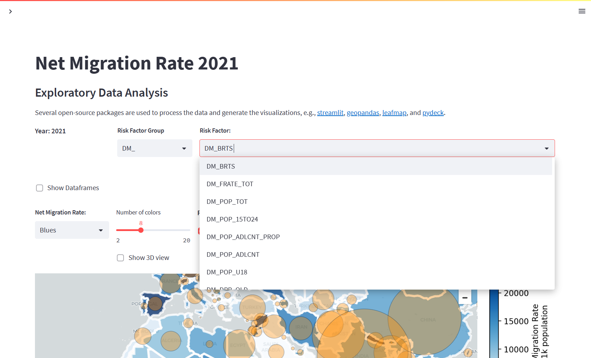

# Unaccompanied Minor Research

## Exploratory Data Analysis

## Overview 

This MVP is an exploratory data analysis tool to examine the risk factors related to underage migrant youths.



---

    MNCH data notes:

    Some important indicators are collected by regions instead of countries.  So we'll write some code to address these.

    - UNFPA_AP : Asia Pacific
    - UNFPA_EECA : Eastern Europe and Central Asia
    - UNFPA_ESA : Eastern and Southern Africa
    - UNFPA_LAC : Latin America and Carribean
    - UNFPA_WCA : Western and Central Africa
    - UNICEF_ECARO : Europe and Central Asia Region
    - UNICEF_EECA : Eastern Europe and Central Asia


## Getting Started & Running the Code

#### Technology Stack:

- [Python](https://www.python.org/) - **venv** to create localized environment.
- [Streamlit](https://streamlit.io/) - User interface


## 1. Setup and Run

Creat virtual environment, then activate:
```bash
$ sudo apt-get install python3.9 python3.9-dev
$ curl https://bootstrap.pypa.io/get-pip.py -o get-pip.py
$ python3.9 get-pip.py
$ python3.9 -m venv env
$ source env/bin/activate

```
Run the streamlit command:
```
(env) $ streamlit run Home.py
```
